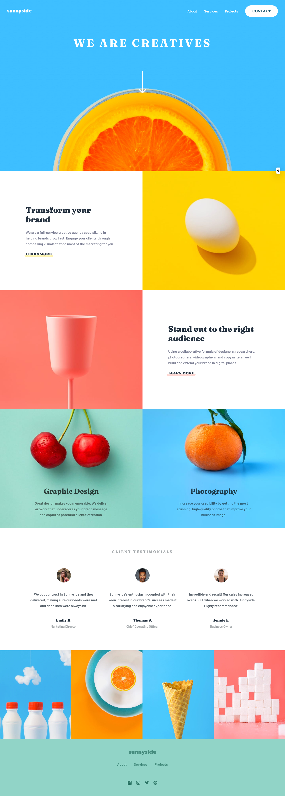

# Frontend Mentor - Sunnyside agency landing page solution

This is a solution to the [Sunnyside agency landing page challenge on Frontend Mentor](https://www.frontendmentor.io/challenges/sunnyside-agency-landing-page-7yVs3B6ef). Frontend Mentor challenges help you improve your coding skills by building realistic projects.

## Table of contents

- [Overview](#overview)
  - [The challenge](#the-challenge)
  - [Screenshot](#screenshot)
  - [Links](#links)
- [My process](#my-process)
  - [Built with](#built-with)
  - [What I learned](#what-i-learned)
  - [Useful resources](#useful-resources)
- [Author](#author)

## Overview

### The challenge

Users should be able to:

- View the optimal layout for the site depending on their device's screen size
- See hover states for all interactive elements on the page

### Screenshot

### Links

- Solution URL: [Github](/)
- Live Site URL: [Vercel](https://csb-17cpc.vercel.app/)

## My process

### Built with

- Semantic HTML5 markup
- CSS custom properties
- Flexbox
- CSS Grid
- Mobile-first workflow
- [React](https://reactjs.org/) - JS library
- [Next.js](https://nextjs.org/) - React framework

### What I learned

After I already started with the site, I came across the [Conquering Responsive Layouts](https://courses.kevinpowell.co/conquering-responsive-layouts) course by Kevin Powell, where I learned a whole lot about mobile first layouts and responsive layouts in general. As i had already started with this project, I decided not to redo it, but instead fix any issues and finish the site with the new knowledge of the course as well as other videos by [Kevin Powell](https://www.youtube.com/kevinpowell).

Other stuff to mention:

- [Responsive images with the picture element](https://developer.mozilla.org/en-US/docs/Learn/HTML/Multimedia_and_embedding/Responsive_images)

### Useful resources

See above

## Author

- Frontend Mentor - [@SebastianBr11](https://www.frontendmentor.io/profile/SebastianBr11)
